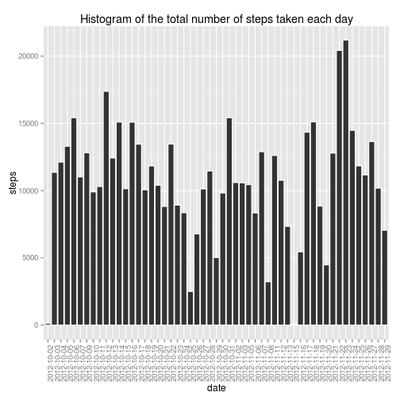
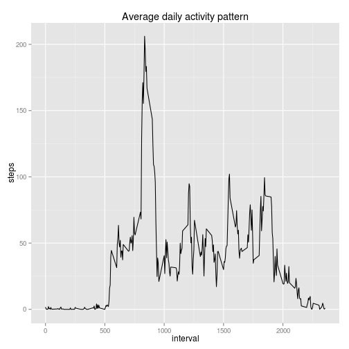
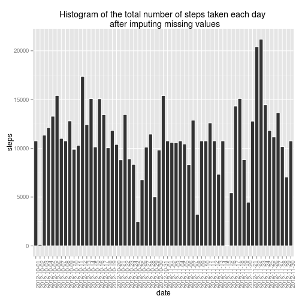
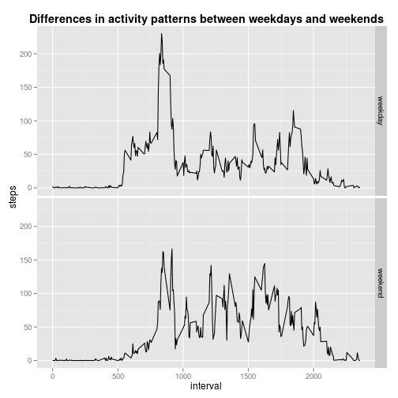

# Reproducible Research: Peer Assessment 1


## Loading and preprocessing the data

```r
if(file.exists("activity.csv") == FALSE){
    unzip(zipfile = 'activity.zip')    
}
activity <- read.csv(file="activity.csv")
```

## What is mean total number of steps taken per day?

Make a histogram of the total number of steps taken each day

```r
library(ggplot2)
dataset <- aggregate(steps~date,activity,sum,na.rm=T)
g <- ggplot(dataset, aes(date, steps))
g <- g + geom_histogram(stat="identity", colour="white")
g <- g + theme(axis.text.x = element_text(angle = 90, hjust = 1))
g <- g + ggtitle("Histogram of the total number of steps taken each day")
print(g)
```

 

Calculate and report the mean and median total number of steps taken per day


```r
mean_tot_num_of_steps = mean(dataset$steps)
median_tot_num_of_steps = median(dataset$steps)
```
The mean for total number of steps is 1.0766 &times; 10<sup>4</sup>  
The median for total number of steps is 10765

## What is the average daily activity pattern?
make a time series plot (i.e. type = "l") of the 5-minute interval (x-axis) and  the average number of steps taken, averaged across all days (y-axis)


```r
dataset <- aggregate(steps~interval,activity,mean,na.rm=T)
g <- ggplot(dataset, aes(interval,steps)) + geom_line()
g <- g + ggtitle("Average daily activity pattern")
print(g)
```

 

Which 5-minute interval, on average across all the days in the dataset, contains the maximum number of steps?

```r
max_interval <- dataset[dataset$steps == max(dataset$steps),]$interval
```
The maximum number of steps is 835

## Imputing missing values

Calculate and report the total number of missing values in the dataset (i.e. the total number of rows with NAs)

```r
tot_of_missing_val <- sum(is.na(activity$steps))
```
The total number of missing value is 2304

Create a new dataset that is equal to the original dataset but with the missing data filled in.
The missing data is filled with the average number of steps taken each 5-minute interval.


```r
new.activity <- activity
mean_per_interval <- aggregate(steps~interval,activity,mean)
mean_per_interval$steps <- round(mean_per_interval$steps)

for(i in seq(1,NROW(mean_per_interval))){        
    new.activity[new.activity$interval == mean_per_interval[i,]$interval & is.na(new.activity$steps),]$steps <- mean_per_interval[i,]$steps
}
```

Make a histogram of the total number of steps taken each day and Calculate and report the mean and median total number of steps taken per day. 

```r
dataset <- aggregate(steps~date,new.activity,sum,na.rm=T)
g <- ggplot(dataset, aes(date, steps))
g <- g + geom_histogram(stat="identity", colour="white")
g <- g + ggtitle("Histogram of the total number of steps taken each day \n after imputing missing values")
g <- g + theme(axis.text.x = element_text(angle = 90, hjust = 1))
print(g)
```

 

```r
mean_tot_num_of_steps <- mean(dataset$steps)
median_tot_num_of_steps <- median(dataset$steps)
```

After imputing missing values, the mean for total number of steps is 1.0766 &times; 10<sup>4</sup>, and the median for total number of steps is 1.0762 &times; 10<sup>4</sup>.

## Are there differences in activity patterns between weekdays and weekends?

Create a new factor variable in the dataset with two levels – “weekday” and “weekend” indicating whether a given date is a weekday or weekend day.


```r
new.activity$weekends <- as.factor(ifelse(weekdays(as.Date(new.activity$date)) %in% c("Saturday","Sunday"),"weekend","weekday"))
```

Make a panel plot containing a time series plot (i.e. type = "l") of the 5-minute interval (x-axis) and the average number of steps taken, averaged across all weekday days or weekend days (y-axis). The plot should look something like the following, which was creating using simulated data:

```r
dataset <- aggregate(steps~interval+weekends,new.activity,mean,na.rm=T)
g <-ggplot(dataset, aes(interval,steps))  
g <- g + geom_line()  
g <- g + facet_grid(weekends ~ .)  
g <- g + ggtitle("Differences in activity patterns between weekdays and weekends")
g <- g + theme(plot.title = element_text(lineheight=.8, face="bold"))
print(g)
```

 

